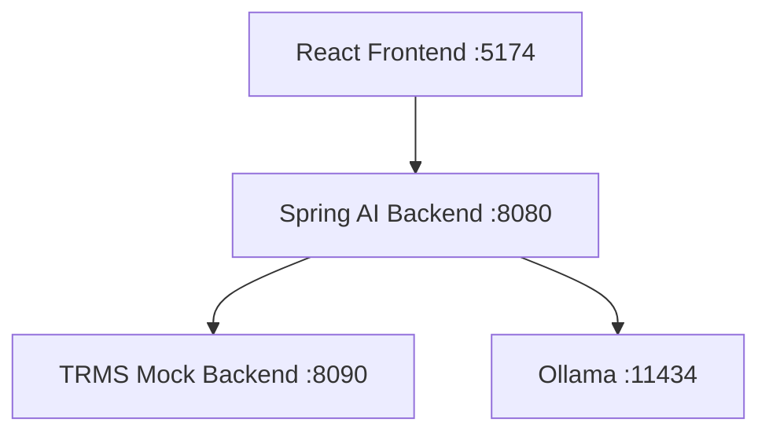

# 🚀 TRMS AI Services Control

This directory contains a comprehensive service management script for the TRMS AI POC system.

## 📋 Quick Start

```bash
# Start all services
./trms-services.sh start

# Check status
./trms-services.sh status

# Stop all services
./trms-services.sh stop
```

## 🎮 Commands

| Command | Description | Example |
|---------|-------------|---------|
| `start` | Start all TRMS services | `./trms-services.sh start` |
| `stop` | Stop all TRMS services | `./trms-services.sh stop` |
| `restart` | Restart all TRMS services | `./trms-services.sh restart` |
| `status` | Show service status | `./trms-services.sh status` |
| `health` | Run health checks | `./trms-services.sh health` |
| `logs [service]` | Show logs | `./trms-services.sh logs ai-backend` |
| `help` | Show help message | `./trms-services.sh help` |

## 🏗️ Services Architecture



### 📱 **Frontend (React + TypeScript)**
- **Port:** 5174 (Vite dev server)
- **URL:** http://localhost:5174
- **Purpose:** Modern Google-like search interface for TRMS operations
- **Features:** Chat interface, animations, real-time updates

### 🤖 **Spring AI Backend**
- **Port:** 8080
- **URL:** http://localhost:8080
- **Health Check:** http://localhost:8080/api/chat/health
- **Purpose:** AI-powered chat interface with TRMS integration
- **Features:** OpenAI/Ollama support, function calling, CORS enabled

### 🏦 **TRMS Mock Backend**
- **Port:** 8090
- **URL:** http://localhost:8090
- **Health Check:** http://localhost:8090/actuator/health
- **Purpose:** Mock Treasury and Risk Management System
- **Features:** REST APIs, financial data, multi-currency support

## 🔧 Configuration

### Environment Variables

The script automatically sets these environment variables:

```bash
# Java Configuration
JAVA_HOME=/opt/homebrew/opt/openjdk@21

# AI Configuration
OLLAMA_ENABLED=true
OLLAMA_BASE_URL=http://localhost:11434
OLLAMA_MODEL=qwen3:1.7b
AI_MODEL=qwen3:1.7b
OPENAI_API_KEY=sk-demo-key
SPRING_PROFILES_ACTIVE=dev
```

### Port Configuration

| Service | Port | Configurable |
|---------|------|--------------|
| Frontend | 5174 | Yes (Vite config) |
| AI Backend | 8080 | Yes (application.yml) |
| Mock Backend | 8090 | Yes (application.yml) |
| Ollama | 11434 | Yes (Ollama config) |

## 📊 Monitoring & Logs

### View Logs
```bash
# All service logs
./trms-services.sh logs

# Specific service logs
./trms-services.sh logs frontend
./trms-services.sh logs ai-backend
./trms-services.sh logs mock-backend
```

### Log Files Location
- **Frontend:** `logs/frontend.log`
- **AI Backend:** `logs/ai-backend.log`
- **Mock Backend:** `logs/mock-backend.log`

### Health Monitoring
```bash
# Quick health check
./trms-services.sh health

# Detailed status
./trms-services.sh status
```

## 🔍 Troubleshooting

### Common Issues

#### Port Already in Use
```bash
# Kill specific port
lsof -ti:8080 | xargs kill -9

# Or use the script
./trms-services.sh stop
```

#### Java/Maven Issues
```bash
# Verify Java installation
java -version
echo $JAVA_HOME

# Check Maven
mvn -version
```

#### Node/NPM Issues
```bash
# Verify Node installation
node -version
npm -version

# Clear npm cache if needed
cd frontend && npm install
```

#### Service Won't Start
```bash
# Check logs for errors
./trms-services.sh logs [service-name]

# Verify dependencies
./trms-services.sh status
```

### Service Dependencies

**Startup Order:**
1. 🏦 TRMS Mock Backend (provides data)
2. 🤖 Spring AI Backend (depends on mock)
3. 📱 Frontend (depends on AI backend)

**Dependency Chain:**
```
Frontend → AI Backend → Mock Backend
Frontend → AI Backend → Ollama (optional)
```

## 🚀 Advanced Usage

### Custom Configuration

#### Changing AI Models
```bash
# Use different Ollama model (must be already pulled)
export OLLAMA_MODEL=llama3.1:8b
./trms-services.sh restart

# Use OpenAI instead of Ollama
export OPENAI_API_KEY=your-real-key
export AI_MODEL=gpt-4o-mini
./trms-services.sh restart

# Disable Ollama completely
export OLLAMA_ENABLED=false
./trms-services.sh restart
```

#### Available Ollama Models
To see available models: `ollama list`
To pull new model: `ollama pull model-name`

Popular models by size:
- `qwen3:1.7b` (1.7B params, fast, default)
- `deepseek-r1:1.5b` (1.5B params, fast, reasoning)
- `llama3.1:8b` (8B params, better quality)
- `llama3.1:70b` (70B params, best quality, slow)

#### Easy Model Switching
```bash
# Switch to a different model temporarily
export OLLAMA_MODEL=llama3.1:8b && ./trms-services.sh restart

# Or edit application.yml permanently:
# spring.ai.ollama.chat.options.model: your-preferred-model
```

### Development Mode
```bash
# Start services individually for development
cd backend/trms-mock-app && mvn spring-boot:run &
cd backend/trms-ai-backend && ./start.sh &
cd frontend && npm run dev &
```

### Production Mode
```bash
# Set production environment
export SPRING_PROFILES_ACTIVE=prod
export NODE_ENV=production
./trms-services.sh start
```

## 📁 Directory Structure

```
/Users/igorchagas/ideas/agentic_trms/
├── trms-services.sh              # Main service control script
├── SERVICES_README.md            # This file
├── setup-ollama.sh               # Ollama setup script
├── OLLAMA_INTEGRATION.md         # Ollama integration guide
├── frontend/                     # React frontend
├── backend/
│   ├── trms-ai-backend/         # Spring AI backend
│   └── trms-mock-app/           # TRMS mock backend
├── logs/                        # Service logs
├── .pids/                       # Process ID files
└── docs/                        # Additional documentation
```

## 🎯 Quick Commands Reference

```bash
# Essential commands
./trms-services.sh start     # Start everything
./trms-services.sh stop      # Stop everything
./trms-services.sh status    # Check what's running
./trms-services.sh health    # Test all endpoints
./trms-services.sh logs      # View all logs

# Debugging commands
./trms-services.sh logs ai-backend | grep ERROR
curl http://localhost:8080/api/chat/health
curl http://localhost:8090/actuator/health
```

## 🎉 Success Indicators

When all services are running correctly, you should see:

✅ **Status Check:**
```
📱 Frontend:      RUNNING (http://localhost:5174)
🤖 AI Backend:    RUNNING (http://localhost:8080)
🏦 Mock Backend:  RUNNING (http://localhost:8090)
```

✅ **Health Check:**
```
📱 Frontend:      HEALTHY
🤖 AI Backend:    HEALTHY
🏦 Mock Backend:  HEALTHY
```

✅ **Access Points:**
- Frontend UI: http://localhost:5174
- Chat API: http://localhost:8080/api/chat
- TRMS API: http://localhost:8090/api/v1/accounts

Your TRMS AI system is now ready for demonstration! 🚀