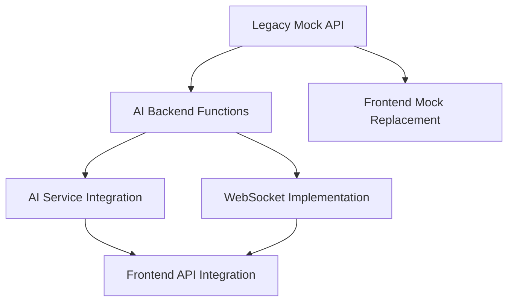

# TRMS AI Agent POC - Project Task Plan

## Executive Summary

This document provides a comprehensive implementation roadmap for the Treasury and Risk Management System (TRMS) AI Agent Proof of Concept. The project demonstrates AI-powered natural language interactions with financial systems using Spring AI and a modern React frontend.

**Status**: Ready for hackathon execution  
**Timeline**: 48-72 hours for complete implementation  
**Team Size**: 3-4 developers  
**Estimated Effort**: 54 development hours total  

---

## 1. Project Overview and Objectives

### 1.1 Vision Statement
Create an intelligent AI-powered assistant that enables natural language interactions with Treasury and Risk Management systems, demonstrating the future of financial operations automation.

### 1.2 Core Objectives
- **Demonstrate AI Integration**: Showcase Spring AI function calling with financial systems
- **Prove Conversational UX**: Natural language interface for complex financial operations
- **Validate Architecture**: Three-tier architecture with mock legacy system integration
- **Enable EOD Automation**: Sophisticated End-of-Day processing with AI recommendations
- **Show Production Readiness**: Docker-based deployment with multiple AI provider support

### 1.3 Key Success Metrics
- ✅ All three components operational (trms-legacy-mock, trms-ai-backend, trms-frontend)
- ✅ AI can successfully execute financial operations via natural language
- ✅ EOD readiness checks with actionable recommendations
- ✅ Google-like UI transitions smoothly to chat interface
- ✅ Single-command deployment via Docker Compose
- ✅ Live demo scenarios executable within 5 minutes

---

## 2. Technical Architecture Summary

### 2.1 System Architecture
```
┌─────────────────┐    ┌──────────────────┐    ┌─────────────────┐
│   React SPA     │    │   Spring AI      │    │  Legacy TRMS    │
│   (Port 3000)   │◄──►│   Backend        │◄──►│   Mock API      │
│                 │    │   (Port 8080)    │    │   (Port 8090)   │
│ • Google-like   │    │ • ChatClient     │    │ • REST API      │
│   Search UI     │    │ • @Function      │    │ • Mock Data     │
│ • Chat Interface│    │   Annotations    │    │ • EOD Logic     │
│ • Framer Motion │    │ • WebSocket      │    │ • Swagger Docs  │
└─────────────────┘    └──────────────────┘    └─────────────────┘
```

### 2.2 Technology Stack
- **AI Framework**: Spring AI 0.8.0 with ChatClient and Function Calling
- **LLM Providers**: Mock (development), OpenAI GPT-3.5-turbo, Ollama Llama 3
- **Backend**: Spring Boot 3.2+, WebSocket, REST API
- **Frontend**: React 19, TypeScript, Framer Motion, TailwindCSS
- **Build Tools**: Maven (backend), Vite (frontend)
- **Deployment**: Docker Compose, multi-stage builds
- **Documentation**: Swagger/OpenAPI, comprehensive README files

### 2.3 Core Business Functions
- **Account Management**: Query accounts by currency with natural language
- **Balance Inquiries**: Real-time balance checks with formatted responses
- **Transaction Processing**: Book transfers between accounts with validation
- **EOD Processing**: Comprehensive End-of-Day readiness with AI recommendations
- **Rate Fixings**: Intelligent rate proposal system for missing LIBOR/EURIBOR fixings
- **Market Data**: Status monitoring for FX rates, equity prices, and interest rates
- **Report Generation**: Dynamic financial report creation and retrieval

---

## 3. Detailed Task Breakdown by Component

### 3.1 Component 1: Legacy TRMS Mock Service (trms-legacy-mock)
**Lead**: Backend Developer A  
**Port**: 8090  
**Estimated Time**: 16 hours (2 days)  

#### Tasks:
1. **Project Setup & Configuration** (2 hours)
   - Spring Boot initialization with web, actuator, swagger dependencies
   - Configure application.yml for port 8090 and development settings
   - Add Lombok for reduced boilerplate code
   - Set up Maven build configuration

2. **Data Models Implementation** (3 hours)
   - Core entities: Account, AccountBalance, Transaction, Report
   - EOD models: MarketDataStatus, TransactionStatusSummary, RateReset, EODCheckResult
   - Request/Response DTOs with validation annotations
   - Builder patterns for test data creation

3. **Mock Data Service** (4 hours)
   - Comprehensive static datasets with realistic financial data
   - Multi-currency account portfolios (USD, EUR, GBP, JPY)
   - Varied transaction states and market data scenarios
   - Configurable EOD readiness states for demo purposes

4. **REST Controllers & API** (5 hours)
   - Account management endpoints with currency filtering
   - Balance inquiry endpoints with real-time simulation
   - Transaction booking with validation and state management
   - EOD processing endpoints with comprehensive status checks
   - Market data and rate fixing endpoints
   - Error handling and HTTP status management

5. **Documentation & Testing** (2 hours)
   - Swagger/OpenAPI 3.0 documentation with examples
   - Postman collection for manual testing
   - Unit tests for services and controllers
   - Health check endpoints for monitoring

**Key Deliverables**:
- Fully functional REST API with 15+ endpoints
- Swagger documentation accessible at /swagger-ui.html
- Realistic mock data for 20+ accounts across multiple currencies
- Complex EOD scenarios for demo purposes

### 3.2 Component 2: Spring AI Backend (trms-ai-backend)
**Lead**: AI/Backend Developer B  
**Port**: 8080  
**Estimated Time**: 22 hours (3 days)  

#### Tasks:
1. **Project Setup & Dependencies** (3 hours)
   - Spring Boot with Spring AI starters (OpenAI, Ollama)
   - WebSocket configuration for real-time chat
   - REST template configuration for legacy system integration
   - Multi-profile setup (development, production)

2. **Legacy TRMS Client** (4 hours)
   - RestTemplate-based client with retry logic
   - Type-safe response handling with ParameterizedTypeReference
   - Error handling and circuit breaker patterns
   - Integration testing with mock legacy system

3. **Spring AI Functions Implementation** (8 hours)
   - `@Function` annotated methods for all business operations
   - Comprehensive function descriptions for AI context
   - Parameter validation and error handling
   - Complex EOD readiness assessment with multi-step logic
   - Rate fixing proposal system with market data integration
   - Transaction validation workflows

4. **AI Service Layer** (4 hours)
   - ChatClient configuration with system prompts
   - Function callback registration and management
   - Mock AI service for development without LLM dependency
   - Multi-provider support (Mock, OpenAI, Ollama)
   - Conversation memory and context management

5. **REST & WebSocket APIs** (2 hours)
   - Chat endpoints with streaming response support
   - WebSocket handlers for real-time communication
   - Health check endpoints with AI mode indicators
   - CORS configuration for frontend integration

6. **Testing & Documentation** (1 hour)
   - Unit tests for all @Function methods
   - Integration tests with mock legacy system
   - API documentation with Spring AI specifics
   - Docker configuration with multi-stage builds

**Key Deliverables**:
- Production-ready Spring AI backend with 8+ business functions
- Mock AI service providing realistic financial responses
- WebSocket support for real-time chat experience
- Comprehensive test coverage for all AI functions

### 3.3 Component 3: React Frontend (trms-frontend)
**Lead**: Frontend Developer C  
**Port**: 3000  
**Estimated Time**: 16 hours (2 days)  

**Status**: Partially implemented - Google-like search interface and chat components exist

#### Tasks:
1. **Component Enhancement & Integration** (4 hours)
   - Review and enhance existing App.jsx implementation
   - Add TypeScript support for better type safety
   - Integrate with real backend API (currently using mock)
   - Error handling and loading states refinement

2. **API Service Implementation** (3 hours)
   - Replace mock API with real backend integration
   - Axios configuration with interceptors and error handling
   - WebSocket integration for real-time chat
   - Health check integration for backend status monitoring

3. **UI/UX Enhancements** (5 hours)
   - Enhanced message formatting for financial data
   - Rich display components for EOD reports
   - Interactive suggestion buttons for common queries
   - Dark mode support and responsive design improvements
   - Accessibility improvements (ARIA labels, keyboard navigation)

4. **Advanced Features** (3 hours)
   - Message export functionality for audit trails
   - Chat history persistence in localStorage
   - Advanced markdown rendering for complex financial reports
   - Copy-to-clipboard functionality for account data

5. **Testing & Build Optimization** (1 hour)
   - Component testing with React Testing Library
   - Build optimization for production deployment
   - Docker configuration with nginx serving
   - Environment variable configuration

**Key Deliverables**:
- Production-ready React application with smooth animations
- Real backend integration with error handling
- Professional financial UI with rich data presentation
- Mobile-responsive design with accessibility compliance

---

## 4. Dependencies and Critical Path

### 4.1 Development Dependencies


### 4.2 Critical Path Analysis
1. **Day 1 Morning**: Legacy Mock API foundation (Developer A)
2. **Day 1 Afternoon**: AI Backend project setup and legacy client (Developer B)
3. **Day 1 Evening**: Frontend API service modification (Developer C)
4. **Day 2 Morning**: AI Functions implementation (Developer B)
5. **Day 2 Afternoon**: Frontend-backend integration testing
6. **Day 2 Evening**: End-to-end integration and Docker setup
7. **Day 3**: Testing, documentation, and demo preparation

### 4.3 Parallel Development Opportunities
- Legacy Mock API and AI Backend can be developed simultaneously
- Frontend enhancement can proceed with existing mock while backend develops
- Documentation and testing can be done in parallel with implementation
- Docker configurations can be prepared early in the process

---

## 5. Risk Mitigation Strategies for Hackathon Constraints

### 5.1 High-Priority Risks & Mitigations

| Risk | Impact | Probability | Mitigation Strategy |
|------|--------|-------------|-------------------|
| **AI Integration Complexity** | High | Medium | Use Mock AI service first, then overlay real LLM |
| **Time Constraints** | High | High | Prioritize core demo flow, defer advanced features |
| **Integration Issues** | Medium | Medium | Establish API contracts early, use health checks |
| **Environment Setup** | Medium | Medium | Provide Docker Compose for consistent environments |
| **Demo Failures** | High | Low | Prepare fallback scenarios and recorded demos |

### 5.2 Technical Risk Management
- **Fallback AI Provider**: Always have Mock AI working as primary demo path
- **Simplified Data Models**: Use minimal viable data structures, expand later
- **Progressive Enhancement**: Build core functionality first, add features incrementally
- **Cross-Platform Testing**: Test on multiple operating systems early
- **Network Resilience**: Implement proper timeout and retry mechanisms

### 5.3 Time Management Strategies
- **MVP Focus**: Implement minimum viable demo path first
- **Incremental Development**: Each component should be independently demoable
- **Parallel Workflows**: Maximize concurrent development opportunities
- **Feature Flags**: Use configuration to enable/disable advanced features
- **Demo-Driven Development**: Prioritize features that enhance demo impact

---

## 6. Success Criteria and Demo Scenarios

### 6.1 Technical Success Criteria
- ✅ **Three-Component Architecture**: All services running independently
- ✅ **AI Function Execution**: Natural language commands trigger financial operations
- ✅ **Real-time Communication**: WebSocket chat functioning smoothly
- ✅ **Data Integration**: Legacy mock data flowing through AI to frontend
- ✅ **Error Handling**: Graceful degradation when components fail
- ✅ **Documentation**: Complete setup and usage documentation

### 6.2 Business Success Criteria
- ✅ **Natural Language Finance**: Complex queries answered intelligently
- ✅ **EOD Automation**: Comprehensive readiness checks with recommendations
- ✅ **Professional UI**: Financial-grade user experience
- ✅ **Multi-Currency Support**: Global treasury operations demonstration
- ✅ **Audit Trail**: All operations properly logged and traceable

### 6.3 Demo Scenarios (5-Minute Demo Flow)

#### Scenario 1: Account Discovery (30 seconds)
```
Query: "Show me all USD accounts"
Expected: List of 5+ USD accounts with details
Demonstrates: AI function calling, data retrieval, formatting
```

#### Scenario 2: Balance Inquiry (30 seconds)
```
Query: "What's the balance for ACC-001-USD?"
Expected: Detailed balance information with timestamps
Demonstrates: Parameter extraction, data lookup, financial formatting
```

#### Scenario 3: Transaction Booking (45 seconds)
```
Query: "Transfer $50,000 from ACC-001-USD to ACC-002-USD for settlement"
Expected: Transaction confirmation with ID and status
Demonstrates: Complex parameter handling, business logic execution
```

#### Scenario 4: EOD Readiness Check (2 minutes)
```
Query: "Can we run End-of-Day processing?"
Expected: Comprehensive readiness report with:
- Market data status (FX rates, equity prices)
- Transaction validation summary
- Missing rate fixings identification
- Actionable recommendations
Demonstrates: Complex multi-step analysis, AI reasoning, financial expertise
```

#### Scenario 5: AI Recommendation (1 minute)
```
Query: "Propose missing rate fixings"
Expected: Intelligent rate proposals with:
- Market-based rate suggestions
- Impact analysis
- Approval workflow recommendations
Demonstrates: AI decision making, financial intelligence, workflow automation
```

#### Scenario 6: Error Handling (30 seconds)
```
Query: "Check balance for invalid-account-id"
Expected: Friendly error message with suggestions
Demonstrates: Robust error handling, user guidance
```

### 6.4 Fallback Demo Strategy
If live AI fails during demo:
1. **Mock AI Responses**: Pre-programmed responses for all scenarios
2. **Recorded Video**: Backup demonstration video available
3. **Static Screenshots**: Key interaction flows documented
4. **Manual Walkthrough**: Code review and architecture explanation

---

## 7. Team Assignment Recommendations

### 7.1 Team Structure (3-4 Developers)

#### Developer A: Backend Systems Specialist
**Responsibilities**:
- Legacy TRMS Mock Service (trms-legacy-mock)
- Docker Compose setup and deployment
- Database/persistence layer (if time allows)
- Integration testing coordination

**Skills Required**:
- Spring Boot expertise
- REST API design
- Financial domain knowledge (helpful)
- Docker and containerization

**Time Allocation**:
- Day 1: Mock service implementation (8 hours)
- Day 2: Integration support and Docker setup (4 hours)
- Day 3: Testing and documentation (4 hours)

#### Developer B: AI/Backend Integration Specialist
**Responsibilities**:
- Spring AI backend implementation (trms-ai-backend)
- AI function development and testing
- WebSocket integration
- Multi-provider AI configuration

**Skills Required**:
- Spring AI framework experience
- LLM integration knowledge
- Function calling and prompt engineering
- WebSocket development

**Time Allocation**:
- Day 1: Project setup and legacy client (6 hours)
- Day 2: AI functions and service layer (8 hours)
- Day 3: Testing and optimization (8 hours)

#### Developer C: Frontend/UX Specialist
**Responsibilities**:
- React frontend enhancement and completion
- API integration and WebSocket client
- UI/UX optimization for financial use cases
- Demo preparation and user experience

**Skills Required**:
- React and TypeScript proficiency
- Modern CSS and animation frameworks
- WebSocket client development
- Financial UI/UX experience (helpful)

**Time Allocation**:
- Day 1: Component enhancement and API integration (8 hours)
- Day 2: Advanced features and real backend integration (8 hours)
- Day 3: Testing, optimization, and demo prep (8 hours)

#### Developer D: DevOps/QA Specialist (Optional)
**Responsibilities**:
- Continuous integration setup
- End-to-end testing automation
- Performance monitoring and optimization
- Demo environment preparation

**Skills Required**:
- Docker and orchestration
- Testing frameworks
- CI/CD pipeline setup
- Performance testing

### 7.2 Communication and Coordination

#### Daily Standups (15 minutes at 9 AM)
- **Yesterday**: What was completed
- **Today**: Current priorities and blockers
- **Dependencies**: What you need from others

#### Integration Checkpoints
- **End of Day 1**: All components can start independently
- **Mid Day 2**: Basic integration working between all components
- **End of Day 2**: Complete feature set implemented and integrated
- **Mid Day 3**: Demo scenarios rehearsed and validated

#### Shared Resources
- **API Contracts**: Document all REST endpoints and WebSocket messages
- **Environment Variables**: Centralized configuration management
- **Docker Compose**: Single-command development environment
- **Demo Scripts**: Prepared queries and expected responses

---

## 8. Implementation Guidelines

### 8.1 Development Best Practices
- **API-First Design**: Define and document all interfaces before implementation
- **Configuration Management**: Use externalized configuration for all environments
- **Error Handling**: Implement comprehensive error handling with user-friendly messages
- **Logging**: Structured logging for debugging and monitoring
- **Testing**: Unit tests for critical business logic, integration tests for API contracts

### 8.2 Quality Assurance
- **Code Reviews**: All commits reviewed by at least one other team member
- **Integration Testing**: Automated tests for all component interactions
- **Demo Rehearsal**: Practice complete demo flow multiple times
- **Performance Testing**: Ensure reasonable response times under demo conditions
- **Documentation**: Complete setup and usage instructions

### 8.3 Deployment Strategy
- **Local Development**: Docker Compose with hot reload for all components
- **Demo Environment**: Production-like setup with stable configurations
- **Backup Plans**: Multiple deployment options (local, cloud, containerized)
- **Health Monitoring**: Automated health checks for all services
- **Quick Recovery**: Scripts for rapid environment restoration

---

## 9. Quick Start Commands

### 9.1 Complete System Startup
```bash
# Clone and setup
git clone <repository-url>
cd trms-ai-poc

# Start all services
docker-compose up -d

# Verify health
curl http://localhost:8090/actuator/health  # Legacy Mock
curl http://localhost:8080/api/chat/health  # AI Backend
curl http://localhost:3000                  # Frontend

# View logs
docker-compose logs -f
```

### 9.2 Development Workflow
```bash
# Legacy Mock Development
cd trms-legacy-mock
mvn spring-boot:run

# AI Backend Development
cd trms-ai-backend
mvn spring-boot:run

# Frontend Development
cd trms-frontend
npm run dev

# Testing
mvn test  # Backend testing
npm test  # Frontend testing
```

### 9.3 Demo Preparation
```bash
# Health check all services
./scripts/health-check.sh

# Load demo data
curl -X POST http://localhost:8090/api/v1/demo/setup

# Validate demo scenarios
./scripts/demo-validation.sh

# Start demo mode (stable configurations)
docker-compose -f docker-compose.demo.yml up
```

---

## 10. Conclusion

This TRMS AI Agent POC represents a comprehensive demonstration of modern AI-powered financial system integration. The project showcases:

- **Technical Innovation**: Spring AI function calling with sophisticated business logic
- **User Experience Excellence**: Google-like interface transforming to professional chat
- **Financial Domain Expertise**: Complex EOD processing with intelligent recommendations
- **Production Readiness**: Docker-based deployment with comprehensive documentation

The task breakdown provides a realistic 48-72 hour implementation timeline for a skilled team, with built-in risk mitigation and fallback strategies suitable for a hackathon environment.

**Success depends on**: Early integration, clear communication, demo-driven development, and focusing on the core value proposition of AI-powered financial operations.

---

*Generated for TRMS AI Agent POC - Treasury and Risk Management System*  
*Target Timeline: 48-72 hours*  
*Team Size: 3-4 developers*  
*Last Updated: 2025-08-12*